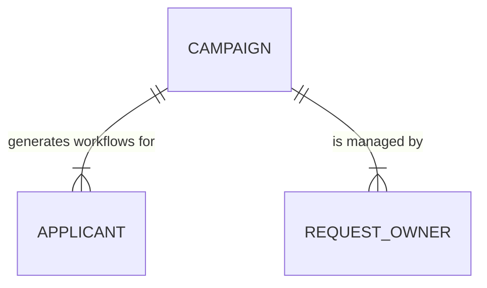
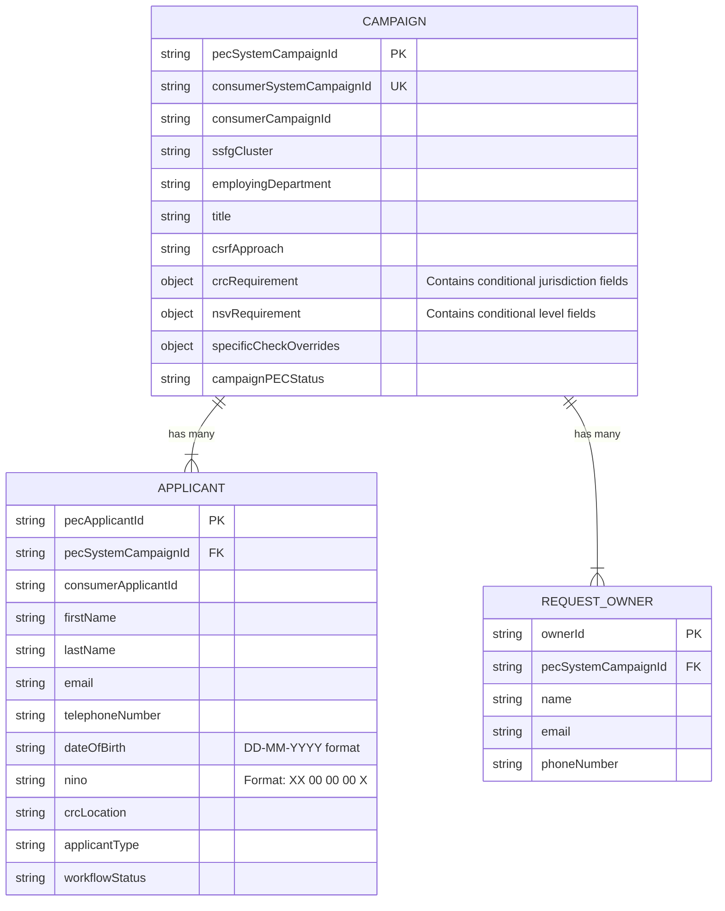
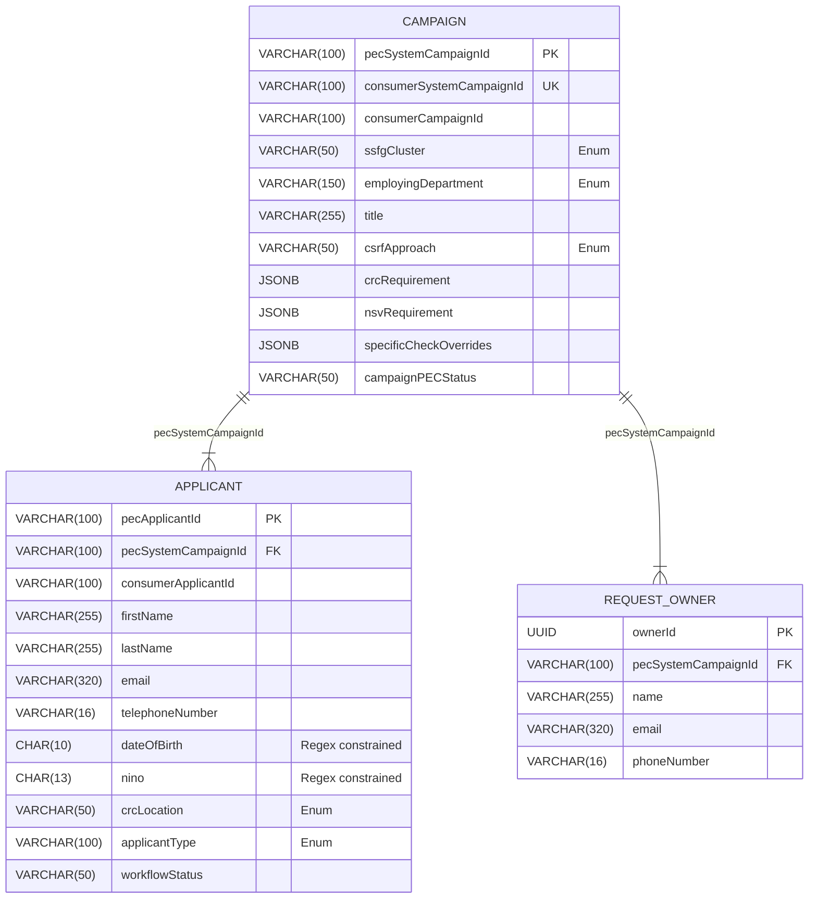

##Conceptual Data model

```mermaid
erDiagram
    CAMPAIGN {
    }
    APPLICANT {
    }
    REQUEST_OWNER {
    }

    CAMPAIGN ||--|{ APPLICANT : "generates workflows for"
    CAMPAIGN ||--|{ REQUEST_OWNER : "is managed by"
```

##Logical model

```mermaid
erDiagram
    CAMPAIGN {
        string pecSystemCampaignId PK
        string consumerSystemCampaignId UK
        string consumerCampaignId
        string ssfgCluster
        string employingDepartment
        string title
        string csrfApproach
        object crcRequirement "Contains conditional jurisdiction fields"
        object nsvRequirement "Contains conditional level fields"
        object specificCheckOverrides
        string campaignPECStatus
    }
    
    APPLICANT {
        string pecApplicantId PK
        string pecSystemCampaignId FK
        string consumerApplicantId
        string firstName
        string lastName
        string email
        string telephoneNumber
        string dateOfBirth "DD-MM-YYYY format"
        string nino "Format: XX 00 00 00 X"
        string crcLocation
        string applicantType
        string workflowStatus
    }
    
    REQUEST_OWNER {
        string ownerId PK 
        string pecSystemCampaignId FK
        string name
        string email
        string phoneNumber
    }

    CAMPAIGN ||--|{ APPLICANT : "has many"
    CAMPAIGN ||--|{ REQUEST_OWNER : "has many"
```

##Physical model

```mermaid
erDiagram
    CAMPAIGN {
        VARCHAR(100) pecSystemCampaignId PK
        VARCHAR(100) consumerSystemCampaignId UK
        VARCHAR(100) consumerCampaignId
        VARCHAR(50) ssfgCluster "Enum"
        VARCHAR(150) employingDepartment "Enum"
        VARCHAR(255) title
        VARCHAR(50) csrfApproach "Enum"
        JSONB crcRequirement
        JSONB nsvRequirement
        JSONB specificCheckOverrides
        VARCHAR(50) campaignPECStatus
    }
    
    APPLICANT {
        VARCHAR(100) pecApplicantId PK
        VARCHAR(100) pecSystemCampaignId FK
        VARCHAR(100) consumerApplicantId
        VARCHAR(255) firstName
        VARCHAR(255) lastName
        VARCHAR(320) email
        VARCHAR(16) telephoneNumber
        CHAR(10) dateOfBirth "Regex constrained"
        CHAR(13) nino "Regex constrained"
        VARCHAR(50) crcLocation "Enum"
        VARCHAR(100) applicantType "Enum"
        VARCHAR(50) workflowStatus
    }
    
    REQUEST_OWNER {
        UUID ownerId PK
        VARCHAR(100) pecSystemCampaignId FK
        VARCHAR(255) name
        VARCHAR(320) email
        VARCHAR(16) phoneNumber
    }

    CAMPAIGN ||--|{ APPLICANT : pecSystemCampaignId
    CAMPAIGN ||--|{ REQUEST_OWNER : pecSystemCampaignId
```

