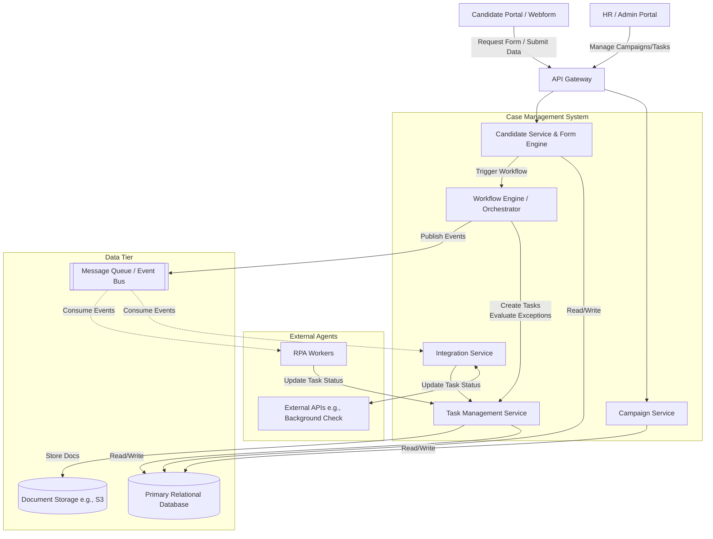
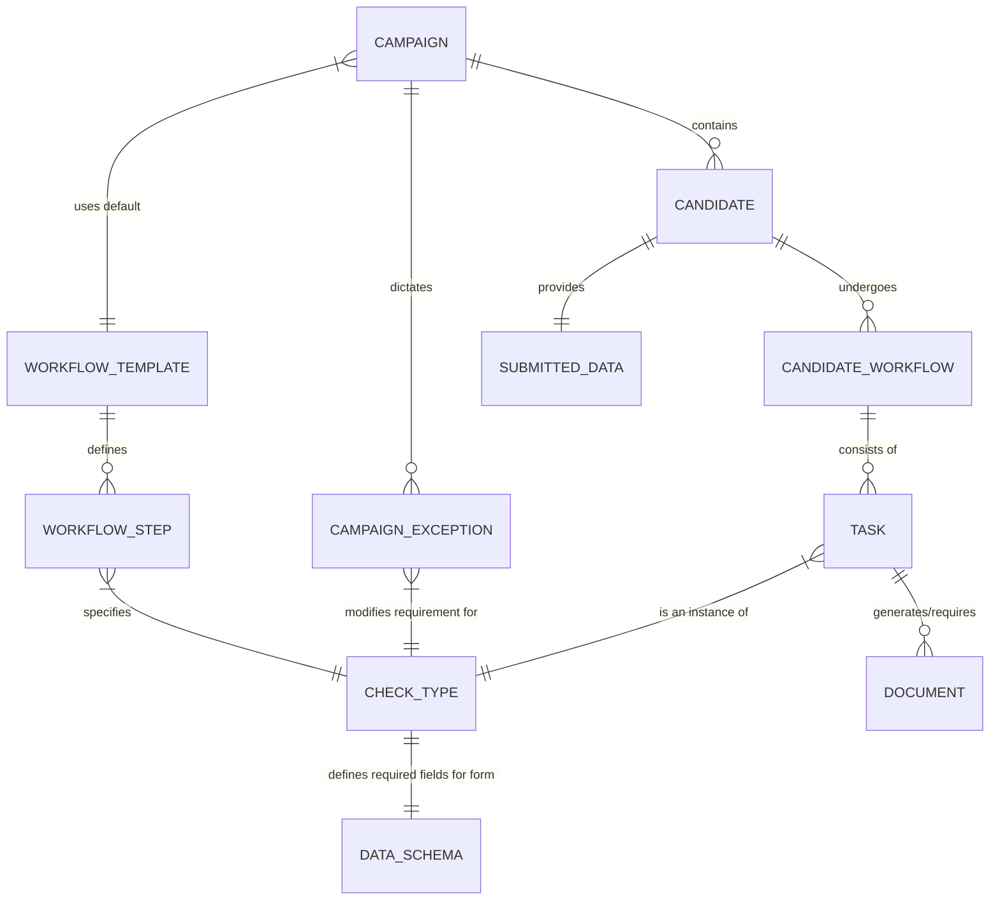
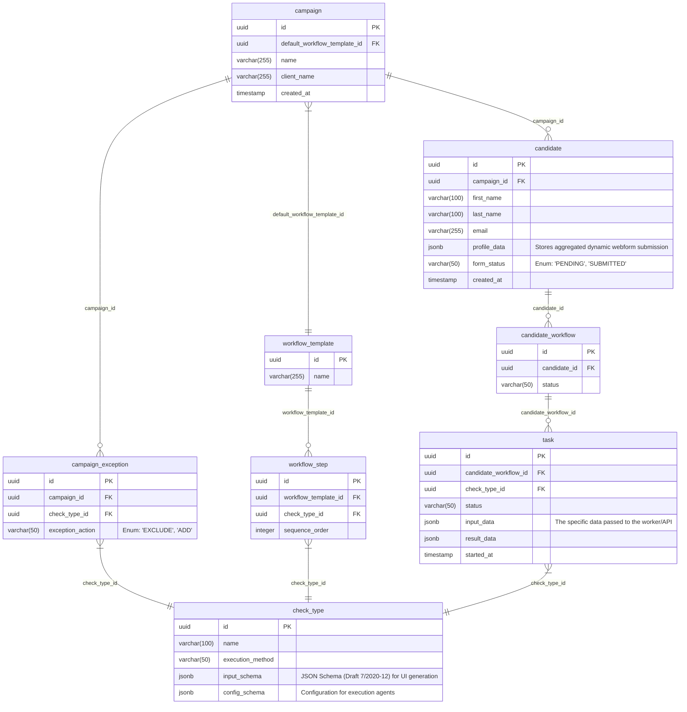

# Pre-Employment Check Case Management System

This document outlines the proposed architecture and data model for a campaign-based pre-employment check system, including dynamic data collection via schema-driven webforms.

## 1. General Architecture Diagram

The system is designed with a microservices-oriented approach. To support dynamic forms, we introduce a **Candidate Portal** and a **Form Schema Engine** within the Candidate Service.

When a candidate is added, the system determines the required checks (Template + Exceptions), merges the data requirements (JSON Schemas) of those checks, and serves a unified dynamic form to the candidate.



## 2. Dynamic Form Flow & Data Architecture

To make the webform dynamic:
1.  **Define Requirements:** Every `Check Type` (e.g., "Right to Work", "Criminal Record") defines its required fields using a JSON Schema (e.g., requires `passport_number`, `5_year_address_history`).
2.  **Schema Merging:** The Form Engine retrieves all checks needed for the candidate, extracts their schemas, and merges them (deduplicating overlapping fields like `date_of_birth`).
3.  **Rendering:** The Candidate Portal uses a library (like React JSON Schema Form) to render the UI automatically from this merged schema.
4.  **Storage:** The submitted data is saved to a single JSONB column on the Candidate profile, which the Workflow Engine later uses to feed individual tasks.

```mermaid
graph LR
    %% Data Flow for Dynamic Forms
    Check1[Right to Work Check\nNeeds: Passport, DOB]
    Check2[Credit Check\nNeeds: Address, DOB, SSN]
    
    Merge[Form Schema Engine\n(Merges & Deduplicates)]
    
    UI[Candidate Portal\nRenders Dynamic Webform]
    
    Storage[(Candidate Profile\nJSONB Data Store)]
    
    TaskDist[Workflow Engine\nDistributes Data to Tasks]

    Check1 --> Merge
    Check2 --> Merge
    Merge -->|Unified JSON Schema| UI
    UI -->|Candidate submits JSON| Storage
    Storage --> TaskDist
    TaskDist -->|Passport, DOB| RPA_Task[RPA: Right to Work]
    TaskDist -->|Address, SSN| API_Task[API: Credit Agency]
```

## 3. Data Models

We have updated the models to include `InputSchema` on the Check Type (to define the form) and `ProfileData` on the Candidate (to store the form answers).

### 3.1 Conceptual Data Model



### 3.2 Logical Data Model

*Note the addition of `InputSchema` to `CHECK_TYPE` and `ProfileData` to `CANDIDATE`.*

```mermaid
erDiagram
    CAMPAIGN {
        ID Identifier PK
        DefaultWorkflowTemplateID Identifier FK
        Name String
        ClientName String
    }

    CAMPAIGN_EXCEPTION {
        ID Identifier PK
        CampaignID Identifier FK
        CheckTypeID Identifier FK
        ExceptionAction String
    }

    CANDIDATE {
        ID Identifier PK
        CampaignID Identifier FK
        Email String
        ProfileData JSON "Stores all dynamic form answers"
        FormStatus String "e.g., PENDING, SUBMITTED"
    }

    WORKFLOW_TEMPLATE {
        ID Identifier PK
        Name String
    }

    WORKFLOW_STEP {
        ID Identifier PK
        WorkflowTemplateID Identifier FK
        CheckTypeID Identifier FK
    }

    CHECK_TYPE {
        ID Identifier PK
        Name String
        ExecutionMethod String
        InputSchema JSON "JSON Schema defining required UI fields"
        ConfigSchema JSON "Execution config for RPA/API"
    }

    CANDIDATE_WORKFLOW {
        ID Identifier PK
        CandidateID Identifier FK
    }

    TASK {
        ID Identifier PK
        CandidateWorkflowID Identifier FK
        CheckTypeID Identifier FK
        InputData JSON "Subset of Candidate ProfileData needed for this specific check"
        ResultData JSON
    }
```



### 3.3 Physical Data Model (PostgreSQL)

