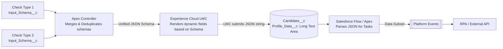
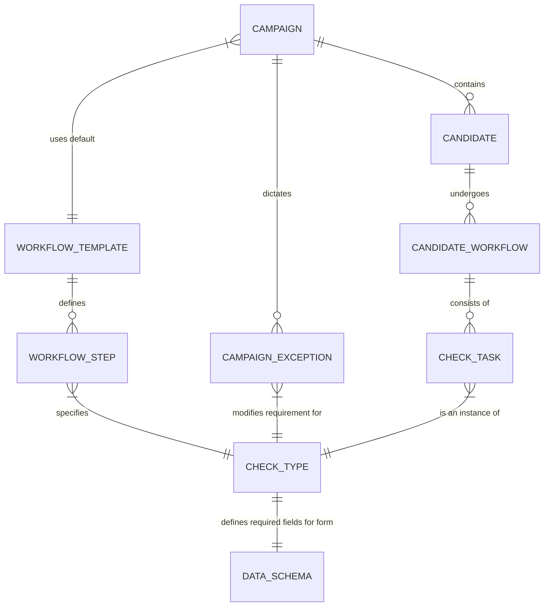
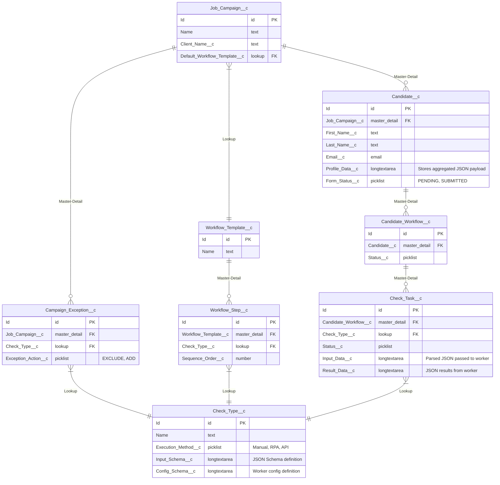

# Pre-Employment Check Case Management System (Salesforce Architecture)

This document outlines the proposed architecture and data model for a campaign-based pre-employment check system built natively on the Salesforce Platform. It includes dynamic data collection via schema-driven Lightning Web Components (LWCs) in Experience Cloud.

## 1. General Architecture Diagram

The system leverages Salesforce core capabilities. Internal HR staff use the standard Lightning Experience (internal CRM), while candidates access dynamic forms via an Experience Cloud site.

Long-running or external tasks (RPA, external APIs) are handled asynchronously using Salesforce Platform Events and External Services / Apex Callouts.

```mermaid
graph TD
    %% User Interfaces
    AdminClient[HR / Admin Portal\nLightning Experience]
    CandidatePortal[Candidate Portal\nExperience Cloud + LWC]

    %% Core Salesforce Platform
    subgraph Salesforce Platform
        ApexEngine[Apex Controllers\nForm Schema Merging]
        FlowEngine[Salesforce Flow / Orchestrator\nWorkflow Engine]
        TaskMgmt[Salesforce Tasks / Custom Objects]
        EventBus[[Platform Events\nEvent Bus]]
        DB[(Salesforce Core Data\nCustom Objects)]
        ExternalServices[Apex Callouts / External Services]
    end

    %% External Systems / Workers
    subgraph External Agents
        RPA[RPA Workers\ne.g., UiPath/BluePrism]
        ExtAPI[External APIs\ne.g., Background Check]
    end

    %% Connections
    AdminClient -->|Manage Campaigns/Candidates| DB
    CandidatePortal -->|Request Form / Submit JSON| ApexEngine
    ApexEngine -->|Read Schemas / Save Data| DB
    
    DB -->|Record-Triggered Flow| FlowEngine
    FlowEngine -->|Create Check Tasks| TaskMgmt
    FlowEngine -->|Publish Event for Automated Checks| EventBus
    
    EventBus -.->|Consume Event (CometD/PubSub API)| RPA
    EventBus -.->|Trigger Async Apex| ExternalServices
    
    ExternalServices <--> ExtAPI
    ExternalServices -->|Update Task via API| TaskMgmt
    
    RPA -->|Update Task via REST API| TaskMgmt
    
    TaskMgmt -->|Read/Write| DB
```

## 2. Dynamic Form Flow & Data Architecture

To make the webform dynamic within Salesforce:

1. **Define Requirements:** Every `Check_Type__c` stores a JSON Schema in a `Text Area (Long)` field.
2. **Schema Merging:** When a candidate views the Experience Cloud page, an Apex Controller retrieves all required checks, extracts their schemas, and merges them (deduplicating fields).
3. **Rendering:** A custom Lightning Web Component (LWC) takes this merged JSON Schema and dynamically renders the input fields on the screen.
4. **Storage:** The submitted data is serialized into a JSON string and saved to a `Text Area (Long)` field (`Profile_Data__c`) on the `Candidate__c` record.
5. **Task Execution:** Salesforce Flow or Apex extracts specific JSON nodes from `Profile_Data__c` and passes them to Platform Events for RPA or API callouts.



## 3. Data Models (Salesforce Schema)

The data model uses Salesforce Custom Objects (denoted by `__c`). 

### 3.1 Conceptual Data Model
*(Focuses on business entities and remains platform-agnostic)*



### 3.2 Logical Data Model
*(Maps out attributes without strict database typing)*

```mermaid
erDiagram
    Job_Campaign {
        ID Record_ID
        Name String
        Client_Name String
        Default_Workflow_Template_ID Reference
    }

    Campaign_Exception {
        ID Record_ID
        Job_Campaign_ID Reference
        Check_Type_ID Reference
        Exception_Action Picklist
    }

    Candidate {
        ID Record_ID
        Job_Campaign_ID Reference
        First_Name String
        Last_Name String
        Email Email
        Profile_Data Long_Text_JSON
        Form_Status Picklist
    }

    Workflow_Template {
        ID Record_ID
        Name String
    }

    Workflow_Step {
        ID Record_ID
        Workflow_Template_ID Reference
        Check_Type_ID Reference
        Sequence_Order Number
    }

    Check_Type {
        ID Record_ID
        Name String
        Execution_Method Picklist
        Input_Schema Long_Text_JSON
        Config_Schema Long_Text_JSON
    }

    Candidate_Workflow {
        ID Record_ID
        Candidate_ID Reference
        Status Picklist
    }

    Check_Task {
        ID Record_ID
        Candidate_Workflow_ID Reference
        Check_Type_ID Reference
        Status Picklist
        Input_Data Long_Text_JSON
        Result_Data Long_Text_JSON
    }
```



### 3.3 Physical Data Model (Salesforce Custom Objects)

In Salesforce, relationships are handled via `Lookup` and `Master-Detail` field types. `Text Area (Long)` is used to store JSON payloads (up to 131,072 characters) since Salesforce does not have a native JSON datatype.

