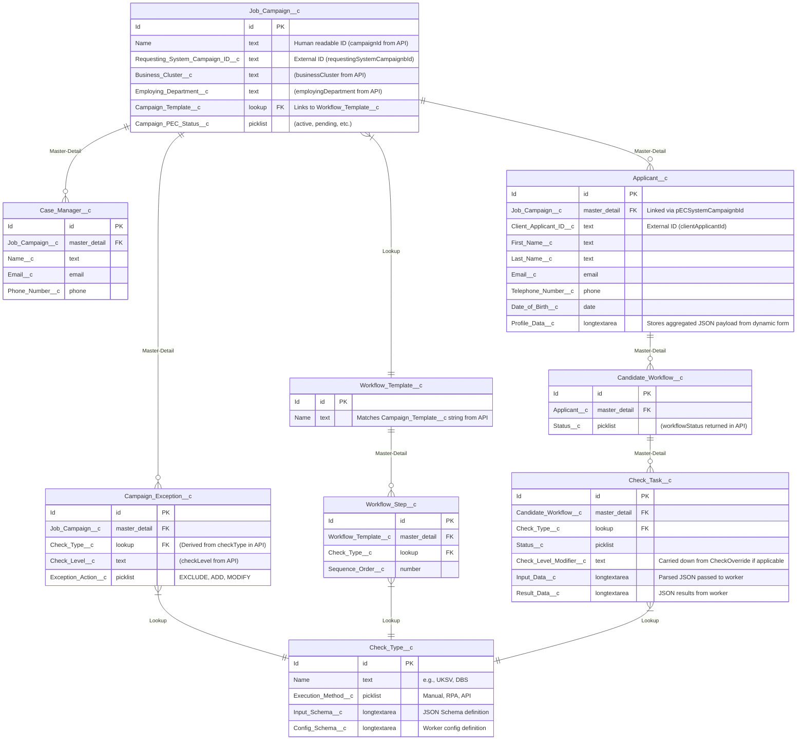

# Pre-Employment Check Case Management System (Salesforce Architecture)

This document outlines the proposed architecture and data model for a campaign-based pre-employment check system built natively on the Salesforce Platform. It includes dynamic data collection via schema-driven Lightning Web Components (LWCs) in Experience Cloud, and models data directly against the `PECRequest2.yaml` API specification.

## 1. General Architecture Diagram

The system leverages Salesforce core capabilities. Internal HR staff use the standard Lightning Experience (internal CRM), while candidates access dynamic forms via an Experience Cloud site.

Long-running or external tasks (RPA, external APIs) are handled asynchronously using Salesforce Platform Events and External Services / Apex Callouts. The initial data ingestion occurs via a RESTful Apex web service that consumes the POST requests defined in the OpenAPI spec.

```mermaid
graph TD
    %% User Interfaces
    AdminClient["HR / Admin Portal<br/>Lightning Experience"]
    CandidatePortal["Candidate Portal<br/>Experience Cloud + LWC"]

    %% Core Salesforce Platform
    subgraph Salesforce Platform
        APIGateway["Apex REST Service<br/>(Endpoints: /campaign, /campaign/{id})"]
        ApexEngine["Apex Controllers<br/>Form Schema Merging"]
        FlowEngine["Salesforce Flow / Orchestrator<br/>Workflow Engine"]
        TaskMgmt["Salesforce Tasks / Custom Objects"]
        EventBus[["Platform Events<br/>Event Bus"]]
        DB[("Salesforce Core Data<br/>Custom Objects")]
        ExternalServices["Apex Callouts / External Services"]
    end

    %% External Systems / Workers
    subgraph External Agents
        RPA["RPA Workers<br/>e.g., UiPath or BluePrism"]
        ExtAPI["External APIs<br/>e.g., Background Check"]
        ClientSystem["Requesting System<br/>(Client HR System)"]
    end

    %% Connections
    ClientSystem -->|POST /campaign & /campaign/{id}| APIGateway
    APIGateway -->|Create Campaign & Applicant Records| DB
    AdminClient -->|Manage Campaigns and Candidates| DB
    
    CandidatePortal -->|Request Form and Submit JSON| ApexEngine
    ApexEngine -->|Read Schemas and Save Data| DB
    
    DB -->|Record-Triggered Flow on Workflow Creation| FlowEngine
    FlowEngine -->|Create Check Tasks| TaskMgmt
    FlowEngine -->|Publish Event for Automated Checks| EventBus
    
    EventBus -.->|"Consume Event via CometD/PubSub"| RPA
    EventBus -.->|Trigger Async Apex| ExternalServices
    
    ExternalServices -->|API Request| ExtAPI
    ExtAPI -->|API Response| ExternalServices
    ExternalServices -->|Update Task via API| TaskMgmt
    
    RPA -->|Update Task via REST API| TaskMgmt
    
    TaskMgmt -->|Read or Write| DB
```

## 2. Dynamic Form Flow & Data Architecture

To make the webform dynamic within Salesforce:

1. **Define Requirements:** Every `Check_Type__c` stores a JSON Schema in a `Text Area (Long)` field (`Input_Schema__c`).

2. **Schema Merging:** When an applicant logs into the Experience Cloud page, an Apex Controller looks at their specific `Candidate_Workflow__c` (which accounts for the base template *plus* any `CheckOverride`s submitted via the API). It retrieves all required checks, extracts their schemas, and merges them to remove duplicate fields (e.g., asking for an address only once).

3. **Rendering:** A custom Lightning Web Component (LWC) takes this merged JSON Schema and dynamically renders the input fields on the screen.

4. **Storage:** The submitted data is serialized into a JSON string and saved to a `Text Area (Long)` field (`Profile_Data__c`) on the `Applicant__c` record.

5. **Task Execution:** Salesforce Flow or Apex extracts specific JSON nodes from `Profile_Data__c` and passes them to Platform Events for RPA or API callouts.

## 3. Data Models (Salesforce Schema)

The physical data model maps directly to the attributes defined in the `PECRequest2.yaml` specification. Salesforce Custom Objects are denoted by `__c`.

### Physical Data Model (Salesforce Custom Objects)

In Salesforce, relationships are handled via `Lookup` and `Master-Detail` field types. External IDs are used heavily here to maintain references back to the `requestingSystemCampaignId` and `clientApplicantId`.



### 3.1 Mapping API Payloads to the Database

When the Salesforce custom Apex REST endpoint receives a payload, it performs the following translations:

**Endpoint: `POST /campaign`**
*   Creates a `Job_Campaign__c` record.
    *   Maps `requestingSystemCampaignbId` to an External ID field for upsert capability.
    *   Uses `campaignTemplate` string to query for the corresponding `Workflow_Template__c.Id`.
*   Iterates over `caseManagers` array, creating child `Case_Manager__c` records linked to the campaign.
*   Iterates over `specificCheckOverrides` (if provided), creating child `Campaign_Exception__c` records. It maps the `checkType` string to a specific `Check_Type__c.Id` and stores the `checkLevel`.
*   *Returns:* The newly generated Salesforce `Id` as the `pECSystemCampaignbId`.

**Endpoint: `POST /campaign/{campaignId}`**
*   Queries the `Job_Campaign__c` using the provided `pECSystemCampaignbId` (or `requestingSystemCampaignbId`).
*   Iterates over the `applicants` array, creating `Applicant__c` records.
    *   Maps `clientApplicantId` to an External ID field.
*   **Trigger Logic:** An Apex Trigger (or Flow) on `Applicant__c` creation automatically generates the `Candidate_Workflow__c` and its child `Check_Task__c` records, factoring in the base Template and any Campaign Exceptions.
*   *Returns:* An array of `WorkflowConfirmation` objects, mapping the source `clientApplicantId` to the newly generated Salesforce `Applicant__c.Id` (`pECApplicantId`) and its workflow status.